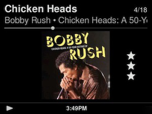
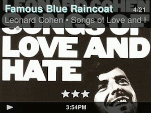

SB Radio - display ratings on *Now Playing* screen
====
tested with Radio firmware version 7.7.3 r16676  

  

  
This manual describes how to display track ratings / rating stars on the Now Playing screen of a **SB Radio** device (that uses the *QVGAlandscape* skin).
   

## Installation

**Enable Remote Access** (ssh) on your SB Radio: *Settings* > *Advanced* > *Remote Login* > *Enable SSH*
  
**Log into** your device (user: root, default password: 1234). You may need to use legacy algorithms and ciphers to log in: 
`ssh -o KexAlgorithms=+diffie-hellman-group1-sha1 -c aes256-cbc root@RadioDeviceIP`
  
**Backup the original applet files** on your device by renaming them: 
`mv /usr/share/jive/applets/NowPlaying/NowPlayingApplet.lua /usr/share/jive/applets/NowPlaying/NowPlayingApplet.lua_ORIGINAL`  
`mv /usr/share/jive/applets/QVGAlandscapeSkin/QVGAlandscapeSkinApplet.lua /usr/share/jive/applets/QVGAlandscapeSkin/QVGAlandscapeSkinApplet.lua_ORIGINAL`
  
**Log out** of your SB Radio with `exit`. **Don't** restart or power off your device!
  
**Copy the new files** you've downloaded from this repository to your SB Radio: 
`scp -o KexAlgorithms=+diffie-hellman-group1-sha1 -c aes256-cbc /path/to/NowPlaying/NowPlayingApplet.lua root@RadioDeviceIP:/usr/share/jive/applets/NowPlaying/`  
`scp -o KexAlgorithms=+diffie-hellman-group1-sha1 -c aes256-cbc /path/to/QVGAlandscapeSkin/QVGAlandscapeSkinApplet.lua root@RadioDeviceIP:/usr/share/jive/applets/QVGAlandscapeSkin/`  
`scp -o KexAlgorithms=+diffie-hellman-group1-sha1 -c aes256-cbc /path/to/QVGAlandscapeSkin/images/NowPlaying/*.png root@RadioDeviceIP:/usr/share/jive/applets/QVGAlandscapeSkin/images/`
  
**Reboot** your SB Radio: 
`ssh -o KexAlgorithms=+diffie-hellman-group1-sha1 -c aes256-cbc root@deviceIP reboot`
  
**Disable SSH** on your device if no longer needed.
     
**Disclaimer:** Modifying the NowPlaying applet and the QVGAlandscape skin applet works for me. But *I don't take any responsibility* if you mess up your Now Playing screen in the process. If you forgot to back up the original files before modifying them and it didn't work out, you can always reset the firmware (restore factory settings).   

**NowPlayingApplet version with subscribe function**: 
I've included a second version of the **NowPlayingApplet.lua** file. This version includes a *subscribe* function that allows your Radio to update the rating value on your *Now Playing* screen without user interaction when the rating value has been changed elsewhere. 
Unfortunately, it makes the *NowPlaying* **menu item** disappear from the *home menu*. Otherwise it works as expected. So it's a trade-off between auto-updating the rating value on the Now Playing screen (while the song is playing) and having the NowPlaying home menu item. If in doubt, use the version **without** the subscribe function.