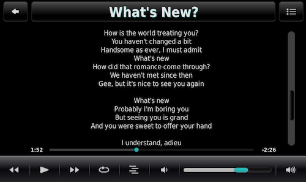

SqueezePlay - display ratings on *Now Playing* screen
====
tested with SqueezePlay v8.0.1r1382 (macOS 12) 

  
  

  
This manual describes how to display track ratings / rating stars on the Now Playing screen of **SqueezePlay** (using the *Joggler* skin). It also includes an **alternative Now Playing View** that **displays track lyrics** (see screenshot 3). You may have to enable this in your settings: *Settings*  > *Screen* > *Now Playing* > *Now Playing Views* > *Lyrics*.  

# Installation

You just have to  move a couple of files. The paths here are for macOS. If you're on Windows or Linux, just locate the corresponding folders and use those.

Look for the **applets** folder (subfolder of the **jive** folder). 
On macOS right-click on the *SqueezePlay* app > *Show Package Contents* > *Contents* > *share* > *jive* > *applets*.
   

## JogglerSkin applet

- Replace the **JogglerSkinApplet.lua** and **strings.txt** in the **JogglerSkin** applet folder with the ones from this repository. 

- Then copy the png image files to the *JogglerSkin* > *images* > **NowPlaying** folder.
   

## NowPlaying applet

- Replace the *NowPlayingApplet.lua* file in the **NowPlaying** applet folder with the one from this repository.
   

Now **restart** Squeezeplay.
     
**Disclaimer:** Modifying the NowPlaying applet and the Joggler skin applet works for me. But *I don't take any responsibility* if you mess up your Now Playing screen in the process.
