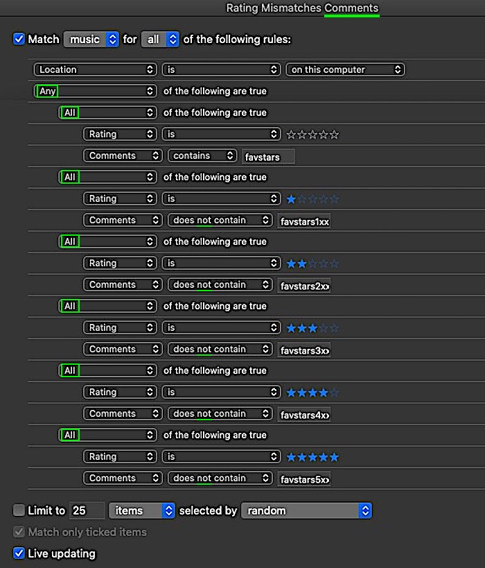
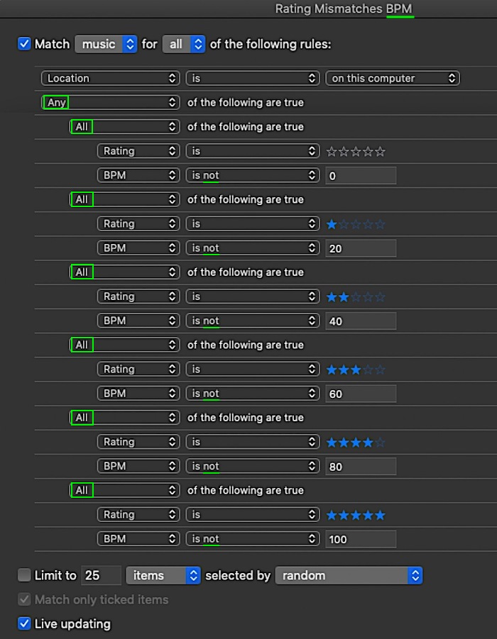

Sync ratings from macOS Music app to LMS with file tags
====
How to sync your Music (app) library ratings to LMS using file tags (BPM or comments)<br><br>


# Summary

All steps at a glance:

- **Create a smart playlist** in the macOS Music app to gather all tracks where the macOS Music app rating and the rating value in the file tags (BPM, comments) do **not** match.<br>

- Use an **Applescript** script that will sync the macOS Music app ratings with the rating values in the file tags.<br>

- If you use a copy of your music files for LMS, sync the changed tracks with that location.<br>

- Have LMS **rescan** your music files.<br>

- Use the LMS plugin *Ratings Light* to **import the rating values from your file tags**.

<br><br>


# Smart playlist

Create a smart playlist in the macOS Music app with all tracks where the Music app rating and the rating value in the file tags do **not** match. The LMS plugin *Ratings Light* supports importing rating values from these file tags: **BPM** or **Comments**.<br>
The **rules** of your smart playlist depend on the selected file tag. To create *nested* rules hold down the *alt* key.
<br><br>

## Comments tag

If you select the **Comments** tag to save rating values in your music files, you have to set at least a rating **keyword pre**fix. To make the string with the rating value even more unique, you'll want to add a rating **keyword suffix**.<br>

**Example**:<br>
Rating keyword **pre**fix = "favstars", rating keyword **suffix** = "xx".<br>
If a comments tag contains "favstars**4**xx" ➜ track rating = **4** stars<br>

**Important**: You have to use **integer rating values on a scale from 1 to 5**. No half-star ratings.<br><br><br>
The **smart playlist for comments tags** should look like this:<br>

<br><br>

<br><br>


## BPM tag

If you select the **BPM** tag to save rating values in your music files, you'll have to use **integer values on a 10-step scale from 0 to 100**. Basically Music app rating multiplied by 20.<br>

````
   0 or no value = unrated
   20 = 1 star
   30 = 1.5 stars
   40 = 2 stars
   …
   100 = 5 stars
````
<br>

The *Ratings Light* LMS plugin supports importing half-star rating values from BPM tags **but** I'm not sure that the macOS Music app still allows you to set half-stars ratings in smart playlist rules.

<br><br>
The **smart playlist for BPM tags** should look like this:<br>

<br><br>

<br><br>

# Applescript

As with the smart playlist, the code of the Applescript script depends on which tag you've selected.<br><br>
The following applies to both:<br>
- Open the macOS **Script Editor** app and paste the code corresponding to your file tag into a new window.<br>

- Then *Script Editor > File >* **Export** the script as an **application** (file format). If you have a code sign ID or (depending on your OS version) a **local execution ID** choose it before saving the application.<br>

- **Move the application to the *Scripts* folder of the Music app**: *~/Library/Music/Scripts*.<br>If the *Scripts* folder does not exist, create it first.

- It should now be listed in the Music app's script menu (in the menu bar). Run it.

<br><br>

## Comments tag

⚠️ **Don't forget to replace the rating keywords** (prefix and suffix) at the beginning of the script **with your own keywords!**<br>

````
property source_playlistName : "Rating Mismatches Comments" -- the name of your smart playlist
property ratingkeywordprefix : "favstars" -- your rating keyword PREfix
property ratingkeywordsuffix : "xx" -- your rating keyword SUFFIX

global newP1, myprogress

set progress completed steps to 0
set progress description to "Fixing tracks whose rating does not match comments tag"

tell application "Music"
	set total to (count every track of playlist source_playlistName)
	set fixedtracks to 0

	repeat with i from 1 to total
		set this_track to track i of playlist source_playlistName
		tell this_track
			set myrating to the rating of this_track
			set mycomment to the comment of this_track

			repeat with ratingval from 0 to 5
				set ratingval to ratingval * 20
				if (myrating = 0 and mycomment contains ratingkeywordprefix) or (myrating = ratingval and mycomment does not contain (ratingkeywordprefix & "2" & ratingkeywordsuffix)) then
					set mycomment to do shell script "echo " & quoted form of mycomment & " | sed -E 's/(" & ratingkeywordprefix & "[1|2|3|4|5]" & ratingkeywordsuffix & ")//g' | sed 's/  */ /g' | sed -e 's/[ ]*$//' | sed -e 's/^[ ]*//'"
					if (rating > 0) then
						set mycomment to ratingkeywordprefix & ratingval & ratingkeywordsuffix & " " & mycomment
						set mycomment to do shell script "echo " & quoted form of mycomment & " | sed 's/  */ /g' | sed -e 's/[ ]*$//' | sed -e 's/^[ ]*//'"
					end if
					set the comment of this_track to mycomment
					set fixedtracks to fixedtracks + 1
				end if
			end repeat
			my progresscounter(total)
		end tell
	end repeat
	beep 4
	display dialog "Fixed " & fixedtracks & " tracks in total." with title "Result" giving up after 10 buttons {"OK"} default button 1
end tell

on progresscounter(total)
	set progress total steps to total as integer
	set progress completed steps to (progress completed steps) + 1
end progresscounter
````
<br><br>

## BPM tag

````
property source_playlistName : "Rating Mismatches BPM"
global newP1, myprogress
set progress completed steps to 0
set progress description to "Fixing tracks whose rating does not match BPM tag"

tell application "Music"
	set total to (count every track of playlist source_playlistName)
	set fixedtracks to 0

	repeat with i from 1 to total
		set this_track to track i of playlist source_playlistName
		tell this_track
			set myrating to the (rating of this_track) * 20
			set mybpm to the bpm of this_track

			if (mybpm is not myrating) then
				set mybpm to myrating
				set fixedtracks to fixedtracks + 1
			end if
			my progresscounter(total)
		end tell
	end repeat
	beep 4
	display dialog "Fixed " & fixedtracks & " tracks in total." with title "Result" giving up after 10 buttons {"OK"} default button 1
end tell

on progresscounter(total)
	set progress total steps to total as integer
	set progress completed steps to (progress completed steps) + 1
end progresscounter
````
<br><br><br><br>

# LMS

If you use a copy of your music files for LMS, sync the changed tracks with that location.<br>
Then make LMS rescan your music files (*clear library and rescan everything*).<br><br>

The last step requires the **Ratings Light** plugin:<br><br>
Go to *LMS > Settings > Advanced > Ratings Light > **Import*** and select the file tag you want to import your ratings from. If it's the comments tag, dont't forget to set your rating keyword(s).<br><br>
Then click on **Import now** to start the import process.<br><br>
If you want LMS to import ratings from file tags *automatically after every rescan*, check the **Include ratings import in LMS scan** option.
